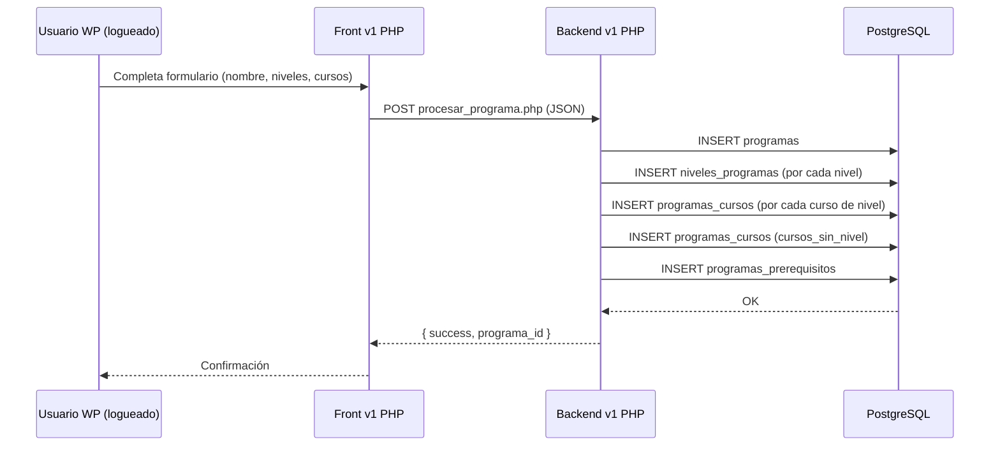
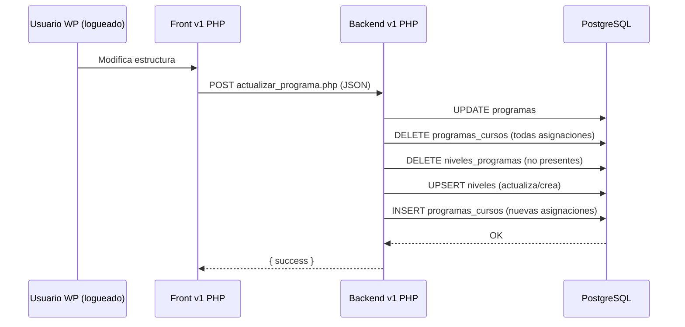
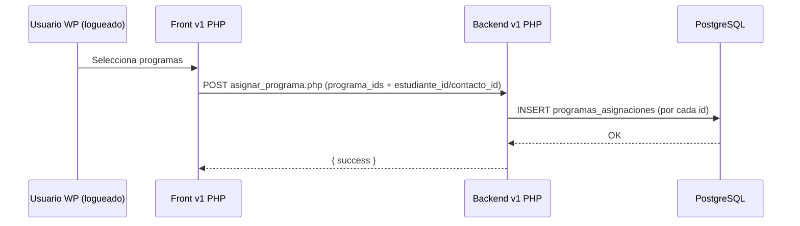

# Programas y Cursos – Flujo v1 (documentación técnica)

Este documento resume cómo funciona la versión v1 (no API-first) para Cursos y Programas: pantallas, endpoints PHP, payloads y efectos en BD.

## Esquema de BD (tablas relevantes)

- cursos
- programas
- niveles_programas
- programas_cursos
- programas_prerequisitos
- estudiantes_cursos

Conteos en entorno de ejemplo: cursos=123, programas=12, niveles=21, programas_cursos=224, estudiantes_cursos=33648.

```mermaid
erDiagram
  PROGRAMAS ||--o{ NIVELES_PROGRAMAS : tiene
  PROGRAMAS ||--o{ PROGRAMAS_CURSOS : contiene
  PROGRAMAS ||--o{ PROGRAMAS_PREREQUISITOS : depende
  NIVELES_PROGRAMAS ||--o{ PROGRAMAS_CURSOS : agrupa
  CURSOS ||--o{ PROGRAMAS_CURSOS : vincula
  ESTUDIANTES ||--o{ ESTUDIANTES_CURSOS : cursa

  PROGRAMAS {
    int id PK
    varchar nombre
    varchar descripcion
  }
  NIVELES_PROGRAMAS {
    int id PK
    int programa_id FK
    varchar nombre
  }
  CURSOS {
    int id PK
    varchar nombre
    int nivel_id
    varchar descripcion
  }
  PROGRAMAS_CURSOS {
    int programa_id FK
    int curso_id FK
    int nivel_id FK NULL
    int consecutivo
  }
  PROGRAMAS_PREREQUISITOS {
    int programa_id FK
    int prerequisito_id FK
  }
  ESTUDIANTES_CURSOS {
    int id PK
    int estudiante_id FK
    int curso_id FK
    date fecha_inicio
    date fecha_fin
  }
```

## Endpoints v1 (PHP directos)

Todos requieren sesión WordPress activa (cookie `wordpress_logged_in_*`).

### Cursos

- GET `backend/cursos/obtener_cursos.php`
  - Respuesta: `{ success, cursos:[ { id, nombre, nivel, descripcion } ] }`

- POST `backend/cursos/crear_curso.php`
  - Body JSON: `{ nombre, nivel_id, descripcion }`

- POST `backend/cursos/editar_curso.php`
  - Body JSON: `{ id, nombre, nivel_id, descripcion }`

### Programas

- GET `backend/programas/obtener_programas.php[?programa_id=ID]`
  - Respuesta: arreglo de programas con niveles, cursos por nivel, cursos sin nivel y prerequisitos.

- GET `backend/programas/obtener_programa.php?programa_id=ID`
  - Respuesta: objeto con la misma estructura de un programa individual.

- POST `backend/programas/procesar_programa.php` (crear)
  - Body JSON:
    ```json
    {
      "nombre": "Nombre",
      "descripcion": "Texto",
      "niveles": [ { "nombre_nivel": "Nivel 1", "cursos": [ { "id": 128, "consecutivo": 1 } ] } ],
      "cursos_sin_nivel": [ { "id": 200, "consecutivo": 1 } ],
      "prerequisitos": [ { "id": 3 } ]
    }
    ```

- POST `backend/programas/actualizar_programa.php`
  - Body JSON:
    ```json
    {
      "programa_id": 12,
      "nombre": "Nuevo",
      "descripcion": "Desc",
      "niveles": [
        { "id": 21, "nombre_nivel": "Nivel 1", "cursos": [ { "id": 128, "consecutivo": 1 } ] },
        { "nombre_nivel": "Nivel nuevo", "cursos": [ { "id": 150, "consecutivo": 1 } ] }
      ],
      "cursosSinNivel": [ { "id": 200, "consecutivo": 2 } ]
    }
    ```
  - Efecto: actualiza programa; borra y re-inserta `programas_cursos`; elimina niveles no usados; inserta/actualiza niveles.

- POST `backend/programas/asignar_programa.php`
  - Body JSON (uno u otro):
    - `{ "programa_ids": [1,2], "estudiante_id": 789 }`
    - `{ "programa_ids": [1,2], "contacto_id": 45 }`

- DELETE `backend/programas/eliminar_programa.php`
  - Body JSON: `{ "programa_id": 12 }`
  - Efecto: hard delete en `programas_prerequisitos`, `programas_cursos`, `niveles_programas` y `programas`.

## Pantallas v1 (front PHP)

- Cursos: `frontend/cursos/listar_cursos.php`, `list.php`, creación/edición (`crear.php`, `crear_curso.php`), calendario (`calendario_cursos.php`).
- Programas: listado (`frontend/programas/listar_programas.php`), detalle (`ver_programa.php`), creación (`crear_programa.php`), edición (`editar_programa.php`).

## Observaciones para migración a v2 (API-first)

- Unificar endpoints REST bajo `plg-genesis/v1/programas` con DTOs consistentes.
- Considerar soft delete (`deleted_at`) para programas.
- Normalizar payloads: `cursosSinNivel` → `cursosSinNivel`/`cursos_sin_nivel` (elegir uno) y usar ids/consecutivo numéricos.
- Reglas de permisos: lectura autenticada, mutaciones con capacidad de edición.

## Diagramas de secuencia (flujos principales)

### Crear programa



### Editar programa



### Asignar programa a estudiante/contacto




